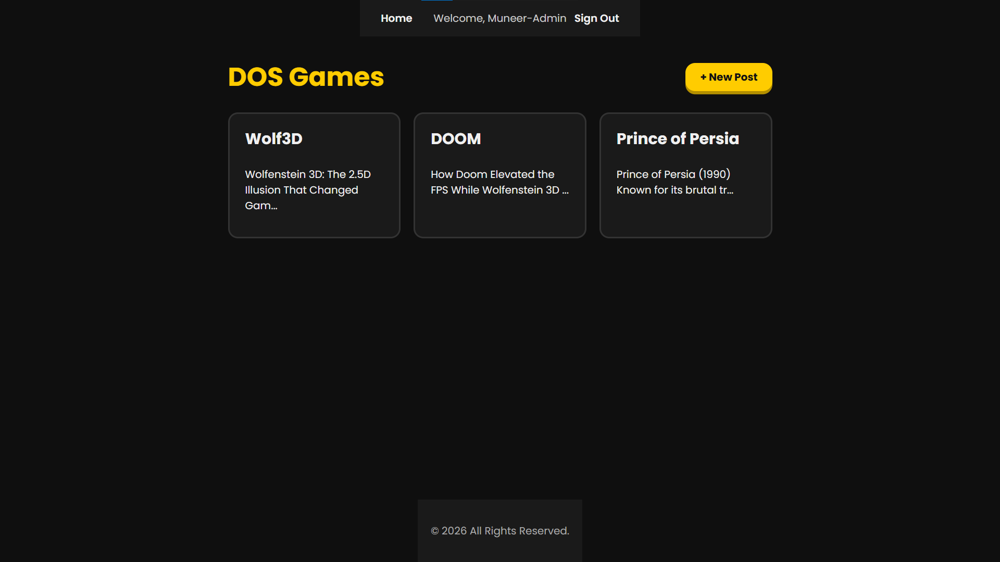
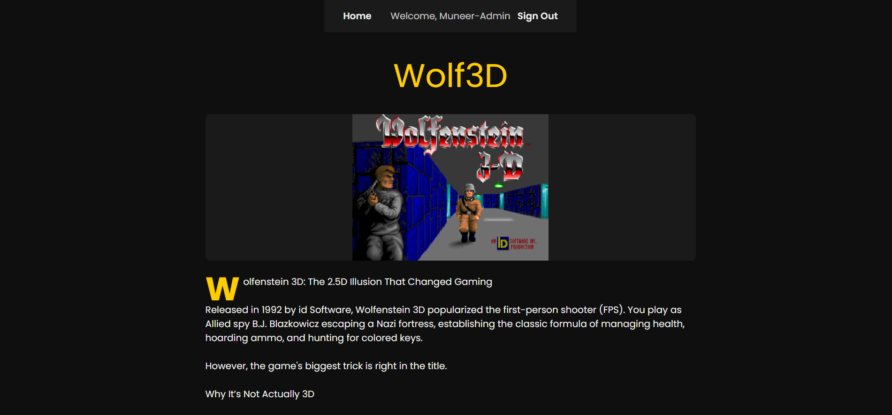

# DOS Games Blog

A blog about classic DOS/id Software games (Wolfenstein 3D, DOOM, Prince of Persia, and more). Signed-in users can read posts covering the history and background of each game, and admins can write new posts with a cover image and an embedded playable shareware episode.

I built this as a MEN stack (MongoDB, Express, Node.js) project to practice full CRUD, session-based authentication, and role-based access control (admin vs. regular user).

## Getting Started

- **Deployed app:** [https://dos-games-blog.onrender.com/](https://dos-games-blog.onrender.com/)
- **ERD:** [View on Google Drive](https://drive.google.com/file/d/1N6qEE0YEt6jozN4G3sfe1WAdqy58k7rW/view?usp=sharing)
- **Wireframe:** [View on Excalidraw](https://excalidraw.com/#json=uggb83N0LoRqebVMxq_ny,KBlERNrMnxACWo7Naq3n5g)

## Attributions

**Images:**
- [MS-DOS directory listing](https://en.wikipedia.org/wiki/DOS#/media/File:Ms-dosdir.png) — Wikipedia
- [DOS with Norton Commander](https://commons.wikimedia.org/wiki/File:Dos_with_Norton_Commander_(45688271474).png) — Wikimedia Commons
- [Microsoft MS-DOS 6.22 floppy disk](https://archive.org/details/MicrosoftMSDOS6.22German) — Internet Archive
- [Sony 3.5" internal floppy drive](https://www.bhphotovideo.com/c/product/589578-REG/Sony_MPF920_Z_CU1_Internal_3_5_Floppy_Drive.html) — B&H Photo Video

**Content:**
- Article text generated with Gemini
- Playable shareware game files sourced from [Archive.org](https://archive.org/)
- Playable game embeds powered by [js-dos](https://js-dos.com/overview.html)

## Technologies Used

- Node.js / Express
- MongoDB / Mongoose
- EJS
- express-session + connect-mongo (session-based auth)
- bcrypt (password hashing)
- method-override
- morgan
- js-dos (in-browser DOS game emulation)

## Next Steps

- Make authentication more secure (currently minimal, built for learning purposes rather than production use)
